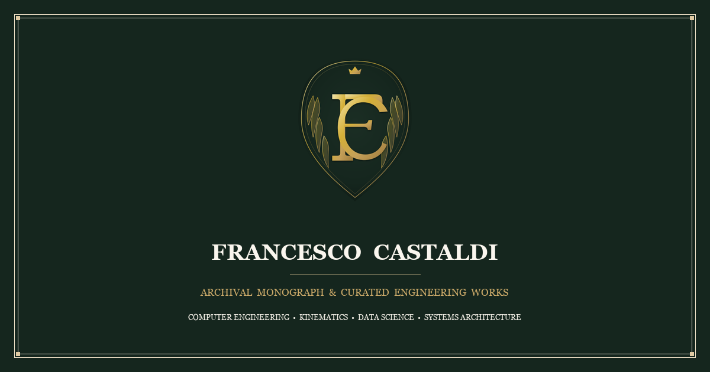
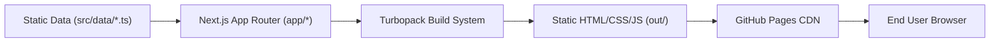

<div align="center">
  <a href="https://francescocastaldi.it" target="_blank">
    
  </a>
  <h1>Francesco Castaldi — Engineering Archives & Curated Works</h1>
  <p><b>Ultra-Low Cortisol, Old Money & Ralph Lauren Heritage Aesthetic — Computer Engineering, Upstream Systems & Automotive Kinematics</b></p>

  <p>
    <a href="https://github.com/FrancescoCastaldi/Francesco.Castaldi.github.io/releases/tag/v0.2.0"></a>
    <a href="https://nextjs.org/"></a>
    <a href="https://tailwindcss.com/"></a>
    <a href="https://www.typescriptlang.org/"></a>
    <a href="https://francescocastaldi.it"></a>
    <a href="LICENSE"></a>
  </p>
</div>

---

<p align="center">
  
</p>

---

## 📌 Table of Contents

- [🏛️ Overview](#️-overview)
- [🚀 Key Features](#-key-features)
- [🏗️ Architecture & File Structure](#️-architecture--file-structure)
- [💻 Core Components Analysis](#-core-components-analysis)
- [⚙️ Quickstart & Usage](#️-quickstart--usage)
- [🔗 Dependencies & Data Flow](#-dependencies--data-flow)
- [⚠️ Gotchas & Developer Notes](#%EF%B8%8F-gotchas--developer-notes)
- [📄 Documentation & References](#-documentation--references)

---

## 🏛️ Overview

Welcome to the official repository of **Francesco Castaldi** — Computer Engineering student at the University of Bologna specializing in **Upstream Systems**, **Full Hybrid (HEV) Automotive Kinematics**, **Radar Weather AI**, and **Data Architecture**.

This platform is crafted as a high-performance **Static Site Generation (SSG)** web monograph modeled after an archival gentlemen's library and classic Savile Row / Ralph Lauren heritage aesthetic. It features deep technical articles, full hybrid kinematics derivations, open-source upstream engineering, and sports telematics.

---

## 🚀 Key Features

- **🏛️ Heritage Gentlemen's Club & Old Money Aesthetic**: Warm mahogany/espresso canvas (`#121110`), British Racing Green surfaces (`#15261E`), satin antique gold accents (`#C5A059`), and soft ivory reading text (`#FAF6EE`).
- **🌿 Ultra-Low Cortisol Visual Experience**: Soft ambient chiaroscuro, hairline gold filigree (`1px solid rgba(197, 160, 89, 0.2)`), relaxed typography leading (`line-height: 1.7`), and gentle transitions (`0.6s–0.8s`).
- **📖 Full Monograph Typography**: Classical Roman serif families (`EB Garamond`, `Cormorant Garamond`, `Newsreader`, `Source Serif 4`) and traditional Roman numerals (`I.`, `II.`, `III.`, `IV.`, `V.`, `VI.`).
- **👑 Bespoke Heraldic Brand Identity**: Intertwined "FC" monogram with laurel wreath in satin gold and British Racing Green, multi-resolution `favicon.ico`, and `<HeritageIcon />` hairline icons (0.85px).
- **⚡ Databaseless Zero-Latency Performance**: 100% pre-rendered static HTML/CSS/JS served via global CDN with zero Node.js server overhead at runtime.

---

## 🏗️ Architecture & File Structure

```
Francesco.Castaldi.github.io/
├── .agents/                      # Custom AI Skill Manifests & Workflows
│   └── skills/
│       ├── blog-post-creator/   # Autonomous UUXD blog post generator
│       ├── md-codemap-analyzer/ # Markdown & codemap architectural auditor
│       └── content-manager/     # Clean formatting & syntax validator
├── docs/                         # Architecture & Deployment Documentation
│   └── ARCHITECTURE.md
├── design/                       # Design System & Styleguide
│   └── styleguide.md
├── public/                       # Static Assets & Generated Media
│   └── assets/
│       ├── blog/                # Article images & cover assets
│       ├── img/
│       │   ├── brand/           # Brand logo emblem (logo.png)
│       │   ├── hero/            # Hero section network graphic
│       │   └── og/              # Open Graph social preview (og-image.png)
├── src/
│   ├── app/                      # Next.js App Router (SSG Pages)
│   │   ├── blog/                 # Blog index & dynamic [slug] reader
│   │   ├── project/              # Project portfolio showcase
│   │   ├── skill/                # Technical skill detail pages
│   │   ├── contact/              # Contact form page
│   │   ├── layout.tsx            # Global layout shell
│   │   └── page.tsx              # Home Page (Automotive Forum & Garage Hub)
│   ├── components/               # Reusable React UI Components
│   │   ├── layout/               # Header, Footer, Navigation
│   │   └── ui/                   # HeroSection, Cards, Modals
│   ├── context/                  # Client-side React Context (LanguageContext)
│   ├── data/                     # Databaseless Content Definitions
│   │   ├── blog-posts.ts         # Blog articles database object
│   │   ├── projects.ts           # Portfolio project data
│   │   └── types.ts              # TypeScript interfaces (BlogPost, Project)
│   └── styles/
│       └── globals.css           # Modern Web CSS Tokens & Utilities
├── AGENTS.md                     # Agent rules & version notes
├── codemap.md                    # Full hierarchical codebase mapping
└── next.config.mjs               # Static Export configuration (output: "export")
```

---

## 💻 Core Components Analysis

### 1. Modern Web CSS Utilities ([`src/styles/globals.css`](file:///c:/Users/franc/Documents/Francesco.Castaldi.github.io/src/styles/globals.css#L112-L160))

Demonstrating Container Queries, CSS `:has()`, and deferred rendering:

```css
/* Container Queries for fluid grid layout */
.forum-grid-container {
  container-type: inline-size;
  container-name: forum-grid;
}

@container forum-grid (min-width: 700px) {
  .forum-card-grid { grid-template-columns: repeat(2, 1fr) !important; }
}

/* Dynamic CSS :has() parent highlighting */
.forum-thread-card:has(a:hover) {
  border-color: var(--color-accent-amber) !important;
  box-shadow: 0 8px 30px rgba(245, 158, 11, 0.15);
}

/* Performance: Deferred rendering for offscreen items */
.thread-list-item {
  content-visibility: auto;
  contain-intrinsic-size: 1px 180px;
}
```

### 2. Automotive Telemetry Hero ([`src/components/ui/HeroSection.tsx`](file:///c:/Users/franc/Documents/Francesco.Castaldi.github.io/src/components/ui/HeroSection.tsx#L250-L270))

High-priority image loading for LCP optimization:

```tsx

```

### 3. Subcategory Taxonomy Data Model ([`src/data/blog-posts.ts`](file:///c:/Users/franc/Documents/Francesco.Castaldi.github.io/src/data/blog-posts.ts#L3-L12))

Structured TypeScript blog post declaration:

```typescript
export const blogPosts: BlogPost[] = [
  {
    title: "Toyota Yaris MK4 HEV Trend MY25: Specs, Tech & Efficiency",
    slug: "toyota-yaris-mk4-hev-trend-my25-review",
    date: "2026-08-13",
    category: "Automotive",
    subcategory: "Toyota Yaris MK4 HEV",
    excerpt: "A deep dive into the Toyota Yaris MK4 HEV Trend MY25, analyzing its 1.5L Dynamic Force hybrid powertrain...",
    // ...
  }
];
```

---

## ⚙️ Quickstart & Usage

### Prerequisites
- **Node.js**: `v18.x` or higher
- **npm**: `v9.x` or higher

### Commands

```bash
# 1. Clone the repository
git clone https://github.com/FrancescoCastaldi/Francesco.Castaldi.github.io.git
cd Francesco.Castaldi.github.io

# 2. Install dependencies
npm install

# 3. Start local development server
npm run dev

# 4. Build static export bundle for production
npm run build
```

Open [http://localhost:3000](http://localhost:3000) to view the development build.

---

## 🔗 Dependencies & Data Flow



---

## ⚠️ Gotchas & Developer Notes

> [!IMPORTANT]
> **Next.js Static Export Constraint**: `next.config.mjs` sets `output: "export"`. There is **no Node.js server at runtime** in production. All dynamic routes (`/blog/[slug]`, `/project/[slug]`, `/skill/[id]`) MUST declare `generateStaticParams()`.

> [!NOTE]
> **Global Agent Skills**: Per repository conventions, all reusable skills reside globally in `C:\Users\franc\.gemini\config\skills\` as well as in local `.agents/skills/`.

> [!TIP]
> **Modern Web Guidance**: Before adding CSS or JavaScript utilities, verify modern browser capabilities using the `modern-web-guidance` skill to leverage native browser features without heavy third-party libraries.

---

## 📄 Documentation & References

- 📋 [`AGENTS.md`](file:///c:/Users/franc/Documents/Francesco.Castaldi.github.io/AGENTS.md) — Agent guidelines and Next.js version rules.
- 🗺️ [`codemap.md`](file:///c:/Users/franc/Documents/Francesco.Castaldi.github.io/codemap.md) — Hierarchical codebase mapping.
- 🏗️ [`docs/ARCHITECTURE.md`](file:///c:/Users/franc/Documents/Francesco.Castaldi.github.io/docs/ARCHITECTURE.md) — Infrastructure decisions and SSG export setup.
- 🎨 [`design/styleguide.md`](file:///c:/Users/franc/Documents/Francesco.Castaldi.github.io/design/styleguide.md) — Design tokens, color palette, and dark mode rules.

---

<div align="center">
  <p>© 2026 Francesco Castaldi — Built with Next.js, TypeScript & Modern Web Standards.</p>
</div>
